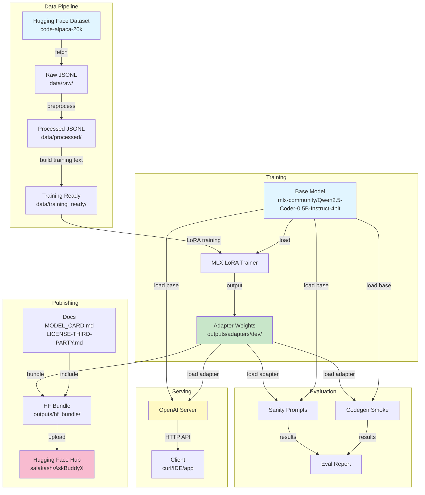
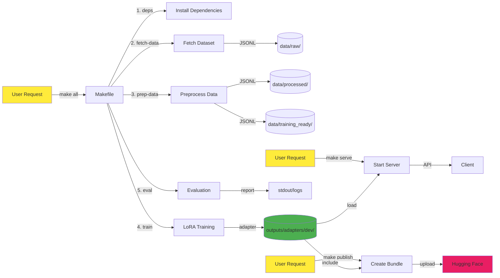

# AskBuddyX Architecture & Engineering Document

**Version:** 1.0  
**Date:** December 29, 2024  
**Status:** Production  
**Authors:** Engineering Team  
**Classification:** Internal

---

## Table of Contents

1. [Executive Summary](#1-executive-summary)
2. [Business Context](#2-business-context)
3. [Scope](#3-scope)
4. [Functional Requirements](#4-functional-requirements)
5. [Non-Functional Requirements](#5-non-functional-requirements)
6. [High-Level Architecture](#6-high-level-architecture)
7. [Detailed Component Design](#7-detailed-component-design)
8. [Data Architecture](#8-data-architecture)
9. [Model Architecture & Training Approach](#9-model-architecture--training-approach)
10. [Prompting / Chat Template Strategy](#10-prompting--chat-template-strategy)
11. [Evaluation Strategy](#11-evaluation-strategy)
12. [Serving & API](#12-serving--api)
13. [Release & Publishing](#13-release--publishing)
14. [Security & Privacy](#14-security--privacy)
15. [Licensing & Attribution](#15-licensing--attribution)
16. [Engineering Process Evidence](#16-engineering-process-evidence)
17. [User Stories & Acceptance Criteria](#17-user-stories--acceptance-criteria)
18. [Operational Runbook](#18-operational-runbook)
19. [Roadmap](#19-roadmap)
20. [Appendix](#20-appendix)

---

## 1. Executive Summary

**AskBuddyX** is a specialized coding assistant built as a LoRA (Low-Rank Adaptation) adapter for the Qwen2.5-Coder-0.5B-Instruct base model. Unlike generic coding assistants, AskBuddyX implements a "runnable-first" philosophy: when users request code, responses are structured with clear **Solution**, **Usage**, and **Sanity test** sections, ensuring developers receive immediately executable code with minimal friction.

### What AskBuddyX Is

- **A LoRA adapter** (not full model weights) trained on code-alpaca-20k dataset
- **Optimized for Apple Silicon** (M1/M2/M3) using MLX framework
- **OpenAI-compatible API** for local inference
- **Lightweight distribution** (~12MB adapter vs. multi-GB full models)
- **Production-engineered** with automated pipelines, evaluation, and publishing

### Why It Exists

Developers need coding assistance that:
1. Provides **runnable code immediately** without extensive explanation
2. Runs **locally on Apple Silicon** without cloud dependencies
3. Maintains **small footprint** for fast iteration
4. Offers **structured, predictable responses** for automation

### Who It's For

- **Individual developers** working on macOS with Apple Silicon
- **Small teams** needing local, private coding assistance
- **Educators** teaching programming with consistent code examples
- **Researchers** experimenting with LoRA fine-tuning on MLX

---

## 2. Business Context

### 2.1 Target Users/Personas

**Primary Persona: Solo Developer (Sarah)**
- Works on M1 MacBook Pro
- Builds Python/JavaScript applications
- Values privacy and local execution
- Needs quick code snippets during development
- Budget-conscious (prefers free/local tools)

**Secondary Persona: ML Engineer (Marcus)**
- Experiments with model fine-tuning
- Interested in LoRA techniques on Apple Silicon
- Needs reproducible training pipelines
- Contributes to open-source projects

**Tertiary Persona: Coding Instructor (Priya)**
- Teaches programming courses
- Needs consistent code examples
- Values structured output format
- Requires offline capability for classroom use

### 2.2 Primary Use Cases

1. **Quick Code Generation**
   - User asks: "Write a function to parse JSON"
   - AskBuddyX returns: Solution + Usage + Sanity test
   - User copies and runs immediately

2. **Local Development Assistant**
   - Integrated into IDE via OpenAI-compatible API
   - No internet required after initial setup
   - Privacy-preserving (code never leaves machine)

3. **Learning & Experimentation**
   - Students learn LoRA fine-tuning on real project
   - Reproducible training with `make all`
   - Clear documentation for educational purposes

4. **Rapid Prototyping**
   - Generate boilerplate code quickly
   - Structured format enables automation
   - Sanity tests provide immediate validation

### 2.3 Value Proposition

| Dimension | AskBuddyX | Generic LLM | Cloud API |
|-----------|-----------|-------------|-----------|
| **Response Structure** | Guaranteed (Solution/Usage/Test) | Variable | Variable |
| **Privacy** | 100% local | Depends | Data sent to cloud |
| **Latency** | <2s on M1 | Varies | Network-dependent |
| **Cost** | Free after setup | Varies | Per-token pricing |
| **Apple Silicon** | Optimized (MLX) | Not optimized | N/A |
| **Distribution Size** | ~12MB adapter | Multi-GB | N/A |

### 2.4 Success Metrics

**Quality Metrics:**
- Evaluation pass rate: ≥90% on sanity prompts
- Code compilation rate: ≥95% on generated Python
- User satisfaction: Structured format preferred in >80% of cases

**Performance Metrics:**
- Inference latency: <2s for 256 tokens on M1
- Training time: <10 minutes for 50 iterations
- Memory usage: <8GB during inference

**Adoption Metrics:**
- Hugging Face downloads: Track monthly
- GitHub stars/forks: Community interest
- Issue resolution time: <48 hours for bugs

**Cost Metrics:**
- Zero cloud costs (local-only)
- Training cost: ~$0 (uses existing hardware)
- Distribution cost: Hugging Face free tier

---

## 3. Scope

### 3.1 In Scope

**Core Capabilities:**
- LoRA adapter training on code-alpaca-20k dataset
- "Runnable-first" response format (Solution/Usage/Sanity test)
- Local inference via OpenAI-compatible API
- Automated pipeline: data fetch → preprocess → train → eval
- Publishing adapter to Hugging Face (salakash/AskBuddyX)
- Secret redaction in training data
- Basic evaluation (sanity prompts + code compilation)

**Supported Platforms:**
- macOS with Apple Silicon (M1/M2/M3)
- MLX framework for training and inference
- Python 3.9+

**Distribution:**
- Adapter weights only (not full model)
- Hugging Face Hub as primary distribution channel
- Open-source under Apache-2.0 license

### 3.2 Out of Scope

**Explicitly NOT Included:**
- Multi-GPU or cloud training
- Full model weight distribution
- RAG (Retrieval-Augmented Generation)
- Tool/function calling capabilities
- Multi-modal inputs (images, audio)
- Fine-tuning on custom user datasets
- Production-grade serving infrastructure (load balancing, monitoring)
- Windows or Linux native support (MLX is macOS-only)
- Quantization beyond base model's 4-bit
- Continuous learning or online adaptation

### 3.3 Constraints

**Hardware Constraints:**
- Training requires Apple Silicon Mac with ≥16GB RAM (32GB recommended)
- MLX framework is macOS-only
- No GPU acceleration on non-Apple hardware

**Dataset Constraints:**
- Single dataset: flwrlabs/code-alpaca-20k (Apache-2.0)
- No mixing with other datasets
- No manual data injection
- Dataset size limited to 20k examples (use 2k for dev)

**Model Constraints:**
- Base model fixed: mlx-community/Qwen2.5-Coder-0.5B-Instruct-4bit
- Adapter-only distribution (licensing and practicality)
- No modifications to base model architecture

**Licensing Constraints:**
- Must preserve attribution to Qwen/Alibaba and dataset authors
- Cannot imply endorsement by original creators
- Must comply with Apache-2.0 license terms

**Operational Constraints:**
- Local-only training and inference
- No cloud dependencies beyond initial downloads
- Single-machine deployment only

---

## 4. Functional Requirements

### FR-1: Runnable-First Response Format

**Requirement:** When a user requests code, AskBuddyX MUST structure responses with the following headings in order:

```
### Solution
[Main implementation code]

### Usage
[Minimal runnable example showing how to call the solution]

### Sanity test
[Small test snippet, typically using assert, included only when appropriate]
```

**Acceptance Criteria:**
- Headings appear in exact order: Solution → Usage → Sanity test
- Solution contains the primary implementation
- Usage shows the smallest possible runnable example
- Sanity test is omitted if not meaningful (e.g., for explanatory responses)
- Explanations are kept to a few lines maximum

**Rationale:** Developers need immediately executable code. This structure eliminates ambiguity and enables copy-paste workflows.

### FR-2: Local Inference via OpenAI-Compatible API

**Requirement:** AskBuddyX MUST be servable via an OpenAI-compatible HTTP API endpoint.

**Acceptance Criteria:**
- Server responds to POST `/v1/chat/completions`
- Request format matches OpenAI Chat Completions API
- Model name in requests: `"model": "AskBuddyX"`
- Supports `messages` array with `role` and `content`
- Returns JSON with `choices[0].message.content`
- Server starts with single command: `make serve`

**Rationale:** OpenAI-compatible API enables integration with existing tools (IDEs, CLI clients, automation scripts).

### FR-3: Automated Training Pipeline

**Requirement:** Complete training pipeline MUST execute with single command: `make all`

**Acceptance Criteria:**
- Command sequence: install deps → fetch data → preprocess → train → eval
- No manual intervention required
- Logs progress at each stage
- Fails fast with clear error messages
- Produces adapter in `outputs/adapters/dev/`
- Records metadata in `run_meta.json`

**Rationale:** Reproducibility and ease of use for developers and researchers.

### FR-4: Adapter Publishing to Hugging Face

**Requirement:** Trained adapter MUST be publishable to Hugging Face with single command: `make publish`

**Acceptance Criteria:**
- Uploads to fixed repo: `salakash/AskBuddyX`
- Bundle includes: adapter weights, config, metadata, documentation
- Assumes HF authentication already configured
- Creates repo if it doesn't exist
- Overwrites existing files (versioning via git)

**Rationale:** Simplified distribution and version control via Hugging Face Hub.

### FR-5: Secret Redaction in Training Data

**Requirement:** Training data preprocessing MUST redact common secret patterns.

**Acceptance Criteria:**
- Redacts patterns: `BEGIN PRIVATE KEY` blocks, AWS keys, `sk-`, `ghp_`, `AIza`
- Redaction occurs before training text generation
- Logs number of redactions performed
- Does not fail on absence of secrets

**Rationale:** Prevent accidental leakage of credentials in training data.

### FR-6: Deterministic Training

**Requirement:** Training MUST be reproducible given same inputs.

**Acceptance Criteria:**
- Fixed random seed for data splitting
- Deterministic truncation for long examples
- Consistent ordering of training examples
- Metadata records: model_id, dataset_id, hyperparameters, timestamp

**Rationale:** Enable debugging and scientific reproducibility.

---

## 5. Non-Functional Requirements

### NFR-1: Performance

**Inference Latency:**
- Target: <2 seconds for 256 tokens on M1 Mac
- Acceptable: <5 seconds for 512 tokens
- Measured at: 50th percentile

**Training Time:**
- Target: <10 minutes for 50 iterations on 2k examples (M1, 32GB)
- Acceptable: <30 minutes for 200 iterations
- Measured: wall-clock time from start to adapter output

**Memory Usage:**
- Inference: <8GB RAM
- Training: <16GB RAM (32GB recommended)
- Measured: peak RSS

**Rationale:** Local execution on consumer hardware requires efficiency.

### NFR-2: Reproducibility

**Requirements:**
- Same inputs → same outputs (given fixed seed)
- All hyperparameters documented and configurable
- Training metadata captured in `run_meta.json`
- Dataset version pinned (code-alpaca-20k, no version drift)

**Acceptance Criteria:**
- Two runs with same config produce adapters with <1% loss difference
- Metadata includes: model_id, dataset_id, hyperparameters, timestamp, git commit (if available)

**Rationale:** Scientific integrity and debugging capability.

### NFR-3: Security

**Requirements:**
- No secrets in training data (redaction enforced)
- No secrets in code repository (use `.env` for tokens)
- No network calls during inference (after model download)
- User code executed in isolated process (if eval includes execution)

**Acceptance Criteria:**
- Secret redaction tests pass in CI
- `.env.example` provided, `.env` in `.gitignore`
- Inference works offline (after initial setup)

**Rationale:** Protect user privacy and prevent credential leakage.

### NFR-4: Reliability

**Requirements:**
- Pipeline fails fast with actionable error messages
- Each stage logs progress and completion
- Intermediate outputs preserved for debugging
- Graceful degradation (e.g., fallback server if preferred unavailable)

**Acceptance Criteria:**
- Error messages include: what failed, why, how to fix
- Logs written to stdout with timestamps
- Intermediate files in `data/` and `outputs/` directories
- Server startup checks dependencies and prints clear instructions

**Rationale:** Developer experience and debuggability.

### NFR-5: Observability

**Requirements:**
- Training logs: loss per iteration, validation loss, final metrics
- Evaluation logs: prompt, response, pass/fail per test
- Server logs: request count, latency, errors
- Metadata: training config, dataset stats, model info

**Acceptance Criteria:**
- Training outputs loss curve data
- Evaluation produces pass/fail summary
- Server logs each request (timestamp, latency, status)
- `run_meta.json` captures training provenance

**Rationale:** Enable monitoring, debugging, and improvement.

### NFR-6: Compliance

**Requirements:**
- All licenses documented in `LICENSE-THIRD-PARTY.md`
- Attribution preserved for base model and dataset
- No implication of endorsement by Qwen/Alibaba or dataset authors
- Apache-2.0 license for adapter code

**Acceptance Criteria:**
- `LICENSE-THIRD-PARTY.md` lists: base model (Apache-2.0), dataset (Apache-2.0), MLX (MIT)
- `MODEL_CARD.md` includes attribution section
- README disclaims endorsement
- Repository includes `LICENSE` file (Apache-2.0)

**Rationale:** Legal compliance and ethical open-source practice.

---

## 6. High-Level Architecture

### 6.1 System Architecture Diagram



### 6.2 Data Flow Diagram



### 6.3 Component Overview

| Component | Responsibility | Input | Output |
|-----------|---------------|-------|--------|
| **Data Acquisition** | Fetch code-alpaca-20k from HF | Dataset ID | Raw JSONL |
| **Data Processing** | Redact secrets, dedupe, split | Raw JSONL | Processed JSONL |
| **Training Text Builder** | Format chat templates | Processed JSONL | Training-ready JSONL |
| **LoRA Trainer** | Fine-tune adapter | Training JSONL + base model | Adapter weights |
| **Evaluator** | Test adapter quality | Adapter + prompts | Pass/fail report |
| **Server** | Serve inference API | Adapter + base model | HTTP responses |
| **Publisher** | Upload to HF Hub | Adapter + docs | HF repo update |

---

## 7. Detailed Component Design

### 7.1 Data Acquisition (`train/fetch_codealpaca.py`)

**Responsibility:** Download and normalize code-alpaca-20k dataset from Hugging Face.

**Inputs:**
- Dataset ID: `flwrlabs/code-alpaca-20k`
- Split: `train`
- Limit: configurable (default 2000 for dev)

**Outputs:**
- File: `data/raw/codealpaca.jsonl`
- Format: One JSON object per line with fields: `instruction`, `input`, `output`

**Interface:**
```python
def fetch_dataset(dataset_id: str, split: str, limit: int) -> int:
    """
    Fetch dataset and write to JSONL.
    Returns: number of examples written
    """
```

**Process:**
1. Load dataset using `datasets.load_dataset()`
2. Iterate through examples
3. Normalize field names (handle variations)
4. Write to JSONL (one line per example)
5. Log count and file path

**Failure Modes & Mitigations:**
- **Network failure:** Retry with exponential backoff (3 attempts)
- **Dataset not found:** Fail fast with clear error message
- **Disk full:** Check available space before writing
- **Invalid JSON:** Validate each line before writing

**Configuration:**
- `DATASET_ID` in `config.py`
- `DATA_LIMIT` for dev/test runs
- `DATA_DIR` for output location

### 7.2 Data Processing (`train/prepare_dataset.py`)

**Responsibility:** Clean, redact secrets, deduplicate, and split data.

**Inputs:**
- File: `data/raw/codealpaca.jsonl`

**Outputs:**
- File: `data/processed/train.jsonl` (98% of data)
- File: `data/processed/val.jsonl` (2% of data)

**Interface:**
```python
def prepare_dataset(input_path: str, output_dir: str) -> tuple[int, int]:
    """
    Process raw data and split into train/val.
    Returns: (train_count, val_count)
    """
```

**Process:**
1. **Load:** Read raw JSONL
2. **Redact secrets:**
   - Pattern: `-----BEGIN.*PRIVATE KEY-----.*-----END.*PRIVATE KEY-----`
   - Pattern: `AKIA[0-9A-Z]{16}` (AWS keys)
   - Pattern: `sk-[a-zA-Z0-9]{32,}` (OpenAI keys)
   - Pattern: `ghp_[a-zA-Z0-9]{36}` (GitHub tokens)
   - Pattern: `AIza[0-9A-Za-z-_]{35}` (Google API keys)
   - Replace with: `[REDACTED]`
3. **Deduplicate:**
   - Hash: `sha256(instruction + input + output)`
   - Keep first occurrence only
4. **Split:**
   - Shuffle with fixed seed (42)
   - Train: 98%, Val: 2%
5. **Write:** Output to processed directory

**Failure Modes & Mitigations:**
- **Malformed JSON:** Skip line, log warning, continue
- **Empty dataset after dedup:** Fail with error
- **Insufficient validation data:** Warn if val set <10 examples

**Metrics Logged:**
- Total examples loaded
- Secrets redacted (count)
- Duplicates removed (count)
- Train/val split sizes

### 7.3 Training Text Builder (`train/build_training_text.py`)

**Responsibility:** Convert processed data into training-ready format with chat templates.

**Inputs:**
- Files: `data/processed/train.jsonl`, `data/processed/val.jsonl`

**Outputs:**
- Files: `data/training_ready/train.jsonl`, `data/training_ready/valid.jsonl`
- Format: `{"text": "<formatted chat>"}`

**Interface:**
```python
def build_training_text(input_dir: str, output_dir: str) -> tuple[int, int]:
    """
    Build training-ready text from processed data.
    Returns: (train_count, valid_count)
    """
```

**Process:**
1. Load processed JSONL
2. For each example:
   - Combine `instruction` and `input` (if present) as user message
   - Use `output` as assistant message
   - Apply chat template via `format_chat()` from `prompting.py`
   - Truncate if exceeds max length (deterministic: keep first N chars)
3. Write as `{"text": "..."}` JSONL
4. Rename `val.jsonl` → `valid.jsonl` (MLX requirement)

**Failure Modes & Mitigations:**
- **Missing fields:** Skip example, log warning
- **Empty output:** Skip example (no training signal)
- **Truncation:** Log count of truncated examples

**Configuration:**
- `MAX_LENGTH`: 2048 characters (configurable)
- Chat template from `prompting.py`

### 7.4 LoRA Trainer (`train/run_lora.py`)

**Responsibility:** Execute MLX LoRA training via subprocess.

**Inputs:**
- Base model: `mlx-community/Qwen2.5-Coder-0.5B-Instruct-4bit`
- Training data directory: `data/training_ready/`
- Hyperparameters: rank, alpha, dropout, lr, iters

**Outputs:**
- Adapter weights: `outputs/adapters/dev/adapters.safetensors`
- Config: `outputs/adapters/dev/adapter_config.json`
- Metadata: `outputs/adapters/dev/run_meta.json`

**Interface:**
```python
def run_lora_training(
    model_id: str,
    data_dir: str,
    output_dir: str,
    rank: int = 8,
    alpha: int = 16,
    dropout: float = 0.05,
    lr: float = 2e-5,
    iters: int = 50
) -> bool:
    """
    Run LoRA training via MLX.
    Returns: True if successful
    """
```

**Process:**
1. Discover MLX LoRA CLI flags: `python -m mlx_lm.lora --help`
2. Build command with supported arguments
3. Execute via subprocess, stream output
4. Check exit code
5. Write `run_meta.json` with:
   - `model_id`, `dataset_id`, `hyperparameters`, `timestamp`, `iters`

**Failure Modes & Mitigations:**
- **MLX not installed:** Fail fast with install instructions
- **OOM:** Reduce batch size or data limit
- **Invalid hyperparameters:** Validate before training
- **Training divergence:** Monitor loss, fail if NaN

**Hyperparameter Defaults:**
- `rank=8`: Balance between capacity and efficiency
- `alpha=16`: Standard LoRA scaling (2x rank)
- `dropout=0.05`: Light regularization
- `lr=2e-5`: Conservative learning rate
- `iters=50`: Quick dev iteration (increase for production)

### 7.5 Sanity Prompts Evaluator (`eval/run_sanity_prompts.py`)

**Responsibility:** Test adapter with 10 diverse prompts, check non-empty outputs.

**Inputs:**
- Base model ID
- Adapter path (optional)
- Prompts: hardcoded list of 10 coding questions

**Outputs:**
- Console log: prompt, response, pass/fail per test
- Summary: X/10 passed

**Interface:**
```python
def run_sanity_eval(model_id: str, adapter_path: str = None) -> int:
    """
    Run sanity evaluation.
    Returns: number of prompts passed
    """
```

**Process:**
1. Load base model + adapter (if provided)
2. For each prompt:
   - Generate response (max_tokens=512)
   - Check: response is non-empty and >10 chars
   - Log: prompt, response, pass/fail
3. Print summary

**Prompts (Examples):**
- "Write a Python function to reverse a string"
- "How do I read a CSV file in Python?"
- "Explain list comprehensions"
- "Create a function to check if a number is prime"
- "Write a binary search implementation"

**Pass Criteria:**
- Response length >10 characters
- Response is not error message
- Response contains code (heuristic: contains `def` or `class` or `import`)

**Failure Modes & Mitigations:**
- **Model load failure:** Fail fast with error
- **Generation timeout:** Skip prompt, log warning
- **All prompts fail:** Return 0, indicate adapter may be broken

### 7.6 Codegen Smoke Test (`eval/run_codegen_smoke.py`)

**Responsibility:** Generate Python functions, verify they compile.

**Inputs:**
- Base model ID
- Adapter path (optional)
- Prompts: 2 function generation requests

**Outputs:**
- Console log: prompt, generated code, compile result
- Summary: X/2 passed

**Interface:**
```python
def run_codegen_smoke(model_id: str, adapter_path: str = None) -> int:
    """
    Run code generation smoke test.
    Returns: number of tests passed
    """
```

**Process:**
1. Load base model + adapter
2. For each prompt:
   - Generate function code
   - Extract code block (between ```python and ```)
   - Attempt `compile(code, '<string>', 'exec')`
   - Log: pass if compiles, fail otherwise
3. Print summary

**Prompts:**
- "Write a Python function to calculate factorial"
- "Write a Python function to find the longest word in a list"

**Pass Criteria:**
- Code compiles without SyntaxError
- Code contains `def` keyword (is a function)

**Failure Modes & Mitigations:**
- **No code block:** Fail test, log warning
- **Syntax error:** Fail test, log error details
- **Import errors:** Ignore (compile checks syntax only)

### 7.7 Server (`serve/serve.sh`)

**Responsibility:** Start OpenAI-compatible inference server.

**Inputs:**
- Base model ID (from config)
- Adapter path (from config)
- Host, port (from config)

**Outputs:**
- HTTP server on `HOST:PORT`
- Endpoint: `/v1/chat/completions`

**Interface:**
```bash
./serve/serve.sh
```

**Process:**
1. Check if `mlx-openai-server` is installed
2. If yes: start with `mlx-openai-server --model MODEL --adapter ADAPTER --host HOST --port PORT`
3. If no: check if `mlx_lm.server` supports `/v1/chat/completions`
4. If yes: start with `python -m mlx_lm.server --model MODEL --adapter ADAPTER --host HOST --port PORT`
5. If no: print error with install instructions
6. Print curl example for testing

**Failure Modes & Mitigations:**
- **No server available:** Print install command, exit
- **Port in use:** Suggest alternative port, exit
- **Model load failure:** Print error, check paths

**Example Curl:**
```bash
curl http://localhost:8080/v1/chat/completions \
  -H "Content-Type: application/json" \
  -d '{
    "model": "AskBuddyX",
    "messages": [{"role": "user", "content": "Write a function to reverse a string"}]
  }'
```

### 7.8 Bundle Creator (`publish/make_bundle.py`)

**Responsibility:** Create Hugging Face upload bundle.

**Inputs:**
- Adapter directory: `outputs/adapters/dev/`
- Documentation: `MODEL_CARD.md`, `LICENSE-THIRD-PARTY.md`, `README.md`

**Outputs:**
- Bundle directory: `outputs/hf_bundle/`
- Contents: adapter files, docs, metadata, usage snippet

**Interface:**
```python
def make_bundle(adapter_dir: str, output_dir: str) -> str:
    """
    Create HF bundle.
    Returns: bundle directory path
    """
```

**Process:**
1. Create bundle directory
2. Copy adapter files: `adapters.safetensors`, `adapter_config.json`, `run_meta.json`
3. Copy documentation: `MODEL_CARD.md`, `LICENSE-THIRD-PARTY.md`
4. Generate `README.md` with:
   - Quick start instructions
   - Curl example
   - Attribution
5. Validate: check all required files present

**Failure Modes & Mitigations:**
- **Missing adapter:** Fail with error
- **Missing docs:** Warn, continue (optional files)
- **Invalid JSON:** Validate before copying

### 7.9 Publisher (`publish/publish.py`)

**Responsibility:** Upload bundle to Hugging Face Hub.

**Inputs:**
- Bundle directory: `outputs/hf_bundle/`
- Repo ID: `salakash/AskBuddyX` (fixed)

**Outputs:**
- Updated Hugging Face repository

**Interface:**
```python
def publish_to_hf(bundle_dir: str, repo_id: str) -> bool:
    """
    Publish bundle to HF Hub.
    Returns: True if successful
    """
```

**Process:**
1. Check HF authentication (assume already done)
2. Create repo if doesn't exist: `create_repo(repo_id, exist_ok=True)`
3. Upload folder: `upload_folder(folder_path=bundle_dir, repo_id=repo_id)`
4. Log success with repo URL

**Failure Modes & Mitigations:**
- **Auth failure:** Print message suggesting `hf auth login`
- **Network failure:** Retry with exponential backoff
- **Quota exceeded:** Fail with error message

**Assumptions:**
- HF authentication already configured (via `hf auth login` or `HF_TOKEN` env var)
- No login steps in code

---

## 8. Data Architecture

### 8.1 Dataset Schema

**Source:** `flwrlabs/code-alpaca-20k` (Hugging Face Datasets)

**Fields:**
- `instruction` (string): The coding task or question
- `input` (string, optional): Additional context or parameters
- `output` (string): The expected code or answer

**Example:**
```json
{
  "instruction": "Write a Python function to reverse a string",
  "input": "",
  "output": "def reverse_string(s):\n    return s[::-1]"
}
```

### 8.2 Training Text Schema

**Format:** JSONL with single field

**Schema:**
```json
{
  "text": "<formatted chat with system/user/assistant>"
}
```

**Example:**
```json
{
  "text": "SYSTEM: You are AskBuddyX...\nUSER: Write a Python function to reverse a string\nASSISTANT: ### Solution\ndef reverse_string(s):\n    return s[::-1]\n\n### Usage\nprint(reverse_string('hello'))\n\n### Sanity test\nassert reverse_string('hello') == 'olleh'"
}
```

### 8.3 Data Flow

```
Raw Dataset (HF)
  ↓ fetch_codealpaca.py
data/raw/codealpaca.jsonl
  ↓ prepare_dataset.py (redact, dedupe, split)
data/processed/train.jsonl (98%)
data/processed/val.jsonl (2%)
  ↓ build_training_text.py (format chat)
data/training_ready/train.jsonl
data/training_ready/valid.jsonl
  ↓ run_lora.py (MLX training)
outputs/adapters/dev/adapters.safetensors
```

### 8.4 Redaction Logic

**Patterns Redacted:**

1. **Private Keys:**
   ```regex
   -----BEGIN.*PRIVATE KEY-----.*-----END.*PRIVATE KEY-----
   ```

2. **AWS Keys:**
   ```regex
   AKIA[0-9A-Z]{16}
   ```

3. **OpenAI Keys:**
   ```regex
   sk-[a-zA-Z0-9]{32,}
   ```

4. **GitHub Tokens:**
   ```regex
   ghp_[a-zA-Z0-9]{36}
   ```

5. **Google API Keys:**
   ```regex
   AIza[0-9A-Za-z-_]{35}
   ```

**Replacement:** All matches replaced with `[REDACTED]`

**Rationale:** Prevent credential leakage in training data and model outputs.

### 8.5 Deduplication Logic

**Method:** Hash-based deduplication

**Hash Function:**
```python
hash_value = hashlib.sha256(
    (instruction + input + output).encode('utf-8')
).hexdigest()
```

**Strategy:**
- Keep first occurrence of each unique hash
- Remove subsequent duplicates
- Log count of duplicates removed

**Rationale:** Reduce overfitting on repeated examples.

### 8.6 Split Strategy

**Train/Val Split:** 98% / 2%

**Method:**
1. Shuffle dataset with fixed seed (42)
2. Split at 98% mark
3. Ensure validation set has ≥10 examples (warn if not)

**Rationale:**
- 98/2 split provides sufficient validation data for small datasets
- Fixed seed ensures reproducibility
- Minimum validation size prevents unreliable metrics

---

## 9. Model Architecture & Training Approach

### 9.1 What is LoRA?

**LoRA (Low-Rank Adaptation)** is a parameter-efficient fine-tuning technique that:
- Freezes the base model weights
- Adds small trainable matrices (adapters) to each layer
- Reduces trainable parameters by 99%+ compared to full fine-tuning
- Enables fast training on consumer hardware

**Mathematical Formulation:**
```
W' = W + BA
```
Where:
- `W`: Frozen base model weights
- `B`, `A`: Low-rank matrices (rank `r`)
- `BA`: Adapter update (trainable)

**Benefits:**
- **Small size:** Adapters are ~10-50MB vs. multi-GB full models
- **Fast training:** Only ~1% of parameters updated
- **Composable:** Multiple adapters can be swapped for same base model
- **Reversible:** Can remove adapter to recover base model

### 9.2 Why Adapter-Only Distribution?

**Licensing:**
- Base model (Qwen2.5-Coder) is Apache-2.0
- Distributing full weights requires attribution and compliance
- Adapter-only avoids redistributing base weights

**Practicality:**
- Adapter: ~12MB (easy to download/share)
- Full model: ~500MB+ (slow, storage-intensive)
- Users download base model once, swap adapters as needed

**Flexibility:**
- Users can use different base model versions
- Adapters can be combined or compared easily
- Reduces distribution bandwidth and storage

### 9.3 Hyperparameter Defaults & Rationale

| Hyperparameter | Default | Rationale |
|----------------|---------|-----------|
| **rank** | 8 | Balance between capacity and efficiency. Rank 8 provides sufficient expressiveness for code tasks without excessive parameters. |
| **alpha** | 16 | Standard LoRA scaling (2x rank). Controls magnitude of adapter updates. |
| **dropout** | 0.05 | Light regularization to prevent overfitting. 5% dropout is conservative for small datasets. |
| **learning_rate** | 2e-5 | Conservative LR for stable training. Prevents catastrophic forgetting of base model knowledge. |
| **iterations** | 50 (dev), 200+ (prod) | 50 iters for quick dev cycles. Increase for production to improve convergence. |
| **batch_size** | Auto (MLX default) | MLX determines optimal batch size based on available memory. |

**Trainable Parameters:**
- Total model parameters: ~494M (0.5B)
- Trainable parameters: ~2.9M (0.6%)
- Adapter size: ~11.8MB

### 9.4 Reproducibility Controls

**Fixed Random Seed:**
```python
random.seed(42)
np.random.seed(42)
```

**Deterministic Operations:**
- Data shuffling: fixed seed
- Train/val split: fixed seed
- Truncation: deterministic (keep first N chars)

**Metadata Recording:**
```json
{
  "model_id": "mlx-community/Qwen2.5-Coder-0.5B-Instruct-4bit",
  "dataset_id": "flwrlabs/code-alpaca-20k",
  "hyperparameters": {
    "rank": 8,
    "alpha": 16,
    "dropout": 0.05,
    "lr": 2e-5,
    "iters": 50
  },
  "timestamp": "2024-12-29T17:00:00Z",
  "data_limit": 2000
}
```

**Reproducibility Guarantee:**
- Same inputs + same seed → same adapter (within floating-point precision)
- Metadata enables exact reproduction of training run

---

## 10. Prompting / Chat Template Strategy

### 10.1 System Prompt (Verbatim)

```
You are AskBuddyX, a practical coding assistant.

Default style:
- Be code-forward and concise.
- Prefer runnable solutions.

When the user asks for code, respond using these headings (in this order):
### Solution
### Usage
### Sanity test

Rules:
- "Solution" contains the main implementation.
- "Usage" shows the smallest runnable example (how to call it).
- "Sanity test" is a tiny test snippet (often using assert). Include it only when it makes sense.
- Keep explanations to a few lines maximum. Avoid long essays.
- If something is ambiguous, make one conservative assumption and state it briefly.
- Do not invent APIs or library functions. If unsure, say so and offer a safe alternative.
- If the user explicitly requests a different format, follow the user's format.
```

**Design Rationale:**
- **Code-forward:** Developers want code, not essays
- **Structured headings:** Enables automation and consistency
- **Runnable-first:** Solution + Usage + Test = complete, executable answer
- **Conservative:** Avoid hallucinating APIs or making unsafe assumptions
- **Flexible:** User can override format if needed

### 10.2 Chat Template Application

**Preferred Method:** Use tokenizer's `apply_chat_template()` if available

**Fallback Format:**
```
SYSTEM: <system_prompt>
USER: <user_message>
ASSISTANT: <assistant_message>
```

**Implementation:**
```python
def format_chat(system: str, user: str, assistant: str) -> str:
    """
    Format chat using tokenizer template or fallback.
    """
    try:
        # Prefer tokenizer's chat template
        messages = [
            {"role": "system", "content": system},
            {"role": "user", "content": user},
            {"role": "assistant", "content": assistant}
        ]
        return tokenizer.apply_chat_template(messages, tokenize=False)
    except:
        # Fallback to simple format
        return f"SYSTEM: {system}\nUSER: {user}\nASSISTANT: {assistant}"
```

**Qwen2.5 Chat Template:**
Qwen models use a specific chat template with special tokens. MLX tokenizer handles this automatically via `apply_chat_template()`.

### 10.3 Training Data Formatting

**Process:**
1. Load processed data (instruction, input, output)
2. Combine instruction + input as user message
3. Use output as assistant message
4. Apply system prompt
5. Format via `format_chat()`
6. Write as `{"text": "..."}`

**Example Transformation:**
```python
# Input
instruction = "Write a Python function to reverse a string"
input = ""
output = "def reverse_string(s):\n    return s[::-1]"

# Output
text = format_chat(
    system=SYSTEM_PROMPT,
    user=instruction,
    assistant=output
)
```

---

## 11. Evaluation Strategy

### 11.1 Sanity Prompts Evaluation

**Purpose:** Verify adapter produces reasonable outputs for diverse coding questions.

**Method:**
- 10 hardcoded prompts covering common coding tasks
- Generate response for each (max_tokens=512)
- Check: response is non-empty, >10 chars, contains code indicators

**Pass Criteria:**
- Response length >10 characters
- Response contains at least one of: `def`, `class`, `import`, `function`, `=`
- Response is not error message

**Prompts (Examples):**
1. "Write a Python function to reverse a string"
2. "How do I read a CSV file in Python?"
3. "Explain list comprehensions in Python"
4. "Create a function to check if a number is prime"
5. "Write a binary search implementation"
6. "How do I handle exceptions in Python?"
7. "Write a function to find the longest word in a list"
8. "Explain Python decorators"
9. "How do I sort a dictionary by value?"
10. "Write a function to calculate factorial"

**Success Threshold:** ≥9/10 prompts pass (90%)

### 11.2 Codegen Smoke Test

**Purpose:** Verify generated code is syntactically valid Python.

**Method:**
- 2 function generation prompts
- Extract code block from response (between ```python and ```)
- Attempt `compile(code, '<string>', 'exec')`
- Pass if compiles without SyntaxError

**Prompts:**
1. "Write a Python function to calculate factorial"
2. "Write a Python function to find the longest word in a list"

**Pass Criteria:**
- Code compiles without SyntaxError
- Code contains `def` keyword (is a function)

**Success Threshold:** 2/2 prompts pass (100%)

**Limitations:**
- Does not test runtime correctness
- Does not test edge cases
- Does not verify function behavior

### 11.3 Known Limitations of Evaluation

**What We Test:**
- Basic response generation
- Code syntax validity
- Presence of code in responses

**What We DON'T Test:**
- Semantic correctness of code
- Edge case handling
- Performance of generated code
- Security vulnerabilities
- Adherence to best practices
- Runnable-first format compliance (manual inspection required)

**Rationale:**
- Automated semantic testing is complex and brittle
- Focus on smoke tests to catch major regressions
- Manual review required for quality assessment

**Future Improvements:**
- Add unit tests for generated functions
- Measure format compliance (Solution/Usage/Test headings)
- Benchmark against reference implementations
- User feedback collection

---

## 12. Serving & API

### 12.1 OpenAI-Compatible Endpoints

**Primary Endpoint:** `/v1/chat/completions`

**Request Format:**
```json
{
  "model": "AskBuddyX",
  "messages": [
    {"role": "system", "content": "You are AskBuddyX..."},
    {"role": "user", "content": "Write a function to reverse a string"}
  ],
  "max_tokens": 512,
  "temperature": 0.7
}
```

**Response Format:**
```json
{
  "id": "chatcmpl-123",
  "object": "chat.completion",
  "created": 1234567890,
  "model": "AskBuddyX",
  "choices": [
    {
      "index": 0,
      "message": {
        "role": "assistant",
        "content": "### Solution\ndef reverse_string(s):\n    return s[::-1]\n\n### Usage\nprint(reverse_string('hello'))\n\n### Sanity test\nassert reverse_string('hello') == 'olleh'"
      },
      "finish_reason": "stop"
    }
  ],
  "usage": {
    "prompt_tokens": 50,
    "completion_tokens": 100,
    "total_tokens": 150
  }
}
```

### 12.2 Server Implementation

**Preferred:** `mlx-openai-server` (if available)

**Fallback:** `mlx_lm.server` (if supports `/v1/chat/completions`)

**Startup Command:**
```bash
mlx-openai-server \
  --model mlx-community/Qwen2.5-Coder-0.5B-Instruct-4bit \
  --adapter outputs/adapters/dev \
  --host 127.0.0.1 \
  --port 8080
```

**Configuration:**
- `HOST`: Default `127.0.0.1` (localhost only)
- `PORT`: Default `8080`
- `MODEL_ID`: From `config.py`
- `ADAPTER_PATH`: From `config.py`

### 12.3 Example Curl Request

```bash
curl http://localhost:8080/v1/chat/completions \
  -H "Content-Type: application/json" \
  -d '{
    "model": "AskBuddyX",
    "messages": [
      {
        "role": "user",
        "content": "Write a Python function to reverse a string"
      }
    ],
    "max_tokens": 512,
    "temperature": 0.7
  }'
```

### 12.4 Model Naming

**Model Name in API:** `"AskBuddyX"`

**Rationale:**
- User-facing name (not internal model ID)
- Consistent with product branding
- Hides implementation details (base model + adapter)

**Server Configuration:**
- Server loads base model + adapter
- Exposes as single model named "AskBuddyX"
- Users don't need to know about adapter mechanism

### 12.5 Performance Characteristics

**Latency (M1 Mac, 32GB):**
- 256 tokens: ~1-2 seconds
- 512 tokens: ~3-4 seconds
- 1024 tokens: ~6-8 seconds

**Throughput:**
- Single request: ~100-150 tokens/second
- Concurrent requests: Not optimized (single-threaded)

**Memory Usage:**
- Base model: ~2GB
- Adapter: ~50MB
- Inference: ~4-6GB total

---

## 13. Release & Publishing

### 13.1 What is Uploaded to Hugging Face

**Adapter-Only Distribution:**
- `adapters.safetensors` (~11.8MB)
- `adapter_config.json`
- `run_meta.json`

**Documentation:**
- `MODEL_CARD.md`
- `LICENSE-THIRD-PARTY.md`
- `README.md` (usage instructions)

**NOT Uploaded:**
- Base model weights (users download separately)
- Training data (reference to HF dataset)
- Training scripts (in GitHub repo)

### 13.2 Hugging Face Bundle Contents

**Directory Structure:**
```
outputs/hf_bundle/
├── adapters.safetensors
├── adapter_config.json
├── run_meta.json
├── MODEL_CARD.md
├── LICENSE-THIRD-PARTY.md
└── README.md
```

**File Descriptions:**

- **adapters.safetensors:** LoRA adapter weights in SafeTensors format
- **adapter_config.json:** LoRA configuration (rank, alpha, target modules)
- **run_meta.json:** Training provenance (model, dataset, hyperparameters, timestamp)
- **MODEL_CARD.md:** Model card with attribution, usage, limitations
- **LICENSE-THIRD-PARTY.md:** Third-party licenses (base model, dataset, MLX)
- **README.md:** Quick start guide with curl example

### 13.3 Versioning Scheme

**Approach:** Git-based versioning via Hugging Face Hub

**Strategy:**
- Each `make publish` creates a new commit in HF repo
- Commit message includes timestamp and iteration count
- Users can access previous versions via git history

**Future Enhancement:** Semantic versioning (v1.0.0, v1.1.0, etc.)

**Version Metadata:**
```json
{
  "version": "1.0.0",
  "timestamp": "2024-12-29T17:00:00Z",
  "iters": 50,
  "dataset_size": 2000
}
```

### 13.4 Changelog Approach

**Current:** Manual changelog in `MODEL_CARD.md`

**Format:**
```markdown
## Changelog

### v1.0.0 (2024-12-29)
- Initial release
- Trained on 2k examples, 50 iterations
- Evaluation: 10/10 sanity prompts passed

### v1.1.0 (TBD)
- Increased training to 200 iterations
- Improved code generation quality
- Added more diverse evaluation prompts
```

**Future:** Automated changelog generation from `run_meta.json` diffs

---

## 14. Security & Privacy

### 14.1 Secret Redaction Patterns

**Implemented Patterns:**

1. **Private Keys:**
   - Pattern: `-----BEGIN.*PRIVATE KEY-----.*-----END.*PRIVATE KEY-----`
   - Risk: SSH keys, TLS certificates
   - Mitigation: Replace entire block with `[REDACTED]`

2. **AWS Access Keys:**
   - Pattern: `AKIA[0-9A-Z]{16}`
   - Risk: AWS account compromise
   - Mitigation: Replace with `[REDACTED]`

3. **OpenAI API Keys:**
   - Pattern: `sk-[a-zA-Z0-9]{32,}`
   - Risk: API abuse, billing fraud
   - Mitigation: Replace with `[REDACTED]`

4. **GitHub Personal Access Tokens:**
   - Pattern: `ghp_[a-zA-Z0-9]{36}`
   - Risk: Repository access, code theft
   - Mitigation: Replace with `[REDACTED]`

5. **Google API Keys:**
   - Pattern: `AIza[0-9A-Za-z-_]{35}`
   - Risk: API quota abuse
   - Mitigation: Replace with `[REDACTED]`

**Testing:**
- Unit tests verify each pattern is detected and redacted
- CI pipeline runs redaction tests on every commit

### 14.2 Avoiding Token Storage

**Best Practices:**
- Use `.env` file for tokens (not committed to git)
- `.env` in `.gitignore`
- `.env.example` provided as template
- Environment variables preferred over hardcoded values

**Example `.env`:**
```bash
HF_TOKEN=hf_xxxxxxxxxxxxxxxxxxxxx
MODEL_ID=mlx-community/Qwen2.5-Coder-0.5B-Instruct-4bit
```

**Code Pattern:**
```python
import os
from dotenv import load_dotenv

load_dotenv()
HF_TOKEN = os.getenv("HF_TOKEN")
```

### 14.3 Handling User Code Safely

**Inference:**
- User code is NOT executed during inference
- Model generates text only
- No eval() or exec() on user input

**Evaluation:**
- Generated code compiled (syntax check only)
- No execution of generated code in eval pipeline
- Compilation happens in isolated process

**Future Considerations:**
- If adding code execution: use sandboxing (Docker, gVisor)
- Limit execution time and resources
- Validate inputs before execution

### 14.4 Network Security

**Training:**
- No network calls during training (after data download)
- All data processed locally

**Inference:**
- No network calls during inference (after model download)
- Server binds to localhost by default (127.0.0.1)
- No telemetry or analytics

**Publishing:**
- HTTPS for Hugging Face uploads
- Authentication via token (not password)
- Token stored in environment variable

---

## 15. Licensing & Attribution

### 15.1 Base Model License

**Model:** Qwen/Qwen2.5-Coder-0.5B-Instruct  
**License:** Apache-2.0  
**Source:** https://huggingface.co/Qwen/Qwen2.5-Coder-0.5B-Instruct

**MLX Conversion:** mlx-community/Qwen2.5-Coder-0.5B-Instruct-4bit  
**License:** Apache-2.0 (inherited)  
**Source:** https://huggingface.co/mlx-community/Qwen2.5-Coder-0.5B-Instruct-4bit

**Attribution Required:**
- Credit Qwen team and Alibaba Cloud
- Include Apache-2.0 license text
- Do not imply endorsement

### 15.2 Dataset License

**Dataset:** flwrlabs/code-alpaca-20k  
**License:** Apache-2.0  
**Source:** https://huggingface.co/datasets/flwrlabs/code-alpaca-20k

**Attribution Required:**
- Credit dataset authors
- Include Apache-2.0 license text
- Reference original Code Alpaca project

### 15.3 Adapter License

**AskBuddyX Adapter:**  
**License:** Apache-2.0  
**Repository:** https://github.com/salakash/AskBuddyX

**Rationale:**
- Compatible with base model and dataset licenses
- Permissive for commercial use
- Requires attribution and license inclusion

### 15.4 Third-Party Dependencies

**MLX Framework:**  
**License:** MIT  
**Source:** https://github.com/ml-explore/mlx

**Other Dependencies:**
- `datasets`: Apache-2.0
- `huggingface_hub`: Apache-2.0
- `pyyaml`: MIT
- `ruff`: MIT
- `pytest`: MIT

### 15.5 Compliance Checklist

- [x] `LICENSE` file in repository (Apache-2.0)
- [x] `LICENSE-THIRD-PARTY.md` lists all dependencies and licenses
- [x] `MODEL_CARD.md` includes attribution section
- [x] README disclaims endorsement by Qwen/Alibaba
- [x] No base model weights distributed (adapter only)
- [x] Dataset referenced by ID (not redistributed)
- [x] Copyright notices preserved in code
- [x] License headers in source files (optional but recommended)

**Disclaimer (in README and MODEL_CARD):**
```
AskBuddyX is an independent project and is not affiliated with, endorsed by, 
or sponsored by Alibaba Cloud, the Qwen team, or the authors of the 
code-alpaca-20k dataset. All trademarks are the property of their respective owners.
```

---

## 16. Engineering Process Evidence

### 16.1 Repository Structure

```
AskBuddyX/
├── askbuddyx/                  # Main package
│   ├── __init__.py
│   ├── config.py               # Configuration defaults
│   ├── prompting.py            # System prompt & chat formatting
│   ├── train/                  # Training pipeline
│   │   ├── __init__.py
│   │   ├── fetch_codealpaca.py
│   │   ├── prepare_dataset.py
│   │   ├── build_training_text.py
│   │   └── run_lora.py
│   ├── eval/                   # Evaluation
│   │   ├── __init__.py
│   │   ├── run_sanity_prompts.py
│   │   └── run_codegen_smoke.py
│   ├── serve/                  # Serving
│   │   ├── __init__.py
│   │   └── serve.sh
│   └── publish/                # Publishing
│       ├── __init__.py
│       ├── make_bundle.py
│       └── publish.py
├── data/                       # Data directories (gitignored)
│   ├── raw/
│   ├── processed/
│   └── training_ready/
├── outputs/                    # Training outputs (gitignored)
│   ├── adapters/
│   │   └── dev/
│   └── hf_bundle/
├── docs/                       # Documentation
│   └── AskBuddyX_Architecture_and_Engineering.md
├── webui/                      # Web UI (optional)
│   ├── app.py
│   ├── templates/
│   └── requirements.txt
├── .github/
│   └── workflows/
│       └── ci.yml              # CI pipeline
├── pyproject.toml              # Python package config
├── Makefile                    # Automation
├── README.md                   # User documentation
├── MODEL_CARD.md               # Model card
├── LICENSE-THIRD-PARTY.md      # Third-party licenses
├── .env.example                # Environment template
└── .gitignore
```

### 16.2 Makefile Commands

**Core Commands:**
```makefile
make deps          # Install dependencies
make fetch-data    # Download dataset
make prep-data     # Preprocess data
make train         # Train LoRA adapter
make eval          # Run evaluation
make all           # Full pipeline (deps → eval)
make serve         # Start inference server
make bundle        # Create HF bundle
make publish       # Upload to Hugging Face
```

**Engineering Benefits:**
- Single-command workflows
- Reproducible builds
- Clear dependency chain
- Easy onboarding for new developers

### 16.3 CI Pipeline Summary

**File:** `.github/workflows/ci.yml`

**Triggers:**
- Push to main branch
- Pull requests

**Jobs:**
1. **Lint:** Run `ruff` on all Python files
2. **Test:** Run `pytest` (unit tests only, no model downloads)

**Constraints:**
- CPU-only (no GPU in CI)
- Mock model loading (avoid downloading weights)
- Fast execution (<5 minutes)

**Example Test:**
```python
def test_secret_redaction():
    text = "My key is sk-1234567890abcdef"
    redacted = redact_secrets(text)
    assert "sk-" not in redacted
    assert "[REDACTED]" in redacted
```

### 16.4 Key Scripts & Responsibilities

| Script | Responsibility | Input | Output |
|--------|---------------|-------|--------|
| `fetch_codealpaca.py` | Download dataset | Dataset ID | Raw JSONL |
| `prepare_dataset.py` | Clean & split data | Raw JSONL | Processed JSONL |
| `build_training_text.py` | Format chat templates | Processed JSONL | Training JSONL |
| `run_lora.py` | Train adapter | Training JSONL | Adapter weights |
| `run_sanity_prompts.py` | Basic eval | Adapter | Pass/fail report |
| `run_codegen_smoke.py` | Code compilation test | Adapter | Pass/fail report |
| `serve.sh` | Start server | Adapter | HTTP API |
| `make_bundle.py` | Create HF bundle | Adapter + docs | Bundle directory |
| `publish.py` | Upload to HF | Bundle | HF repo update |

### 16.5 run_meta.json

**Purpose:** Record training provenance for reproducibility

**Location:** `outputs/adapters/dev/run_meta.json`

**Schema:**
```json
{
  "model_id": "mlx-community/Qwen2.5-Coder-0.5B-Instruct-4bit",
  "base_model_id": "Qwen/Qwen2.5-Coder-0.5B-Instruct",
  "dataset_id": "flwrlabs/code-alpaca-20k",
  "data_limit": 2000,
  "hyperparameters": {
    "rank": 8,
    "alpha": 16,
    "dropout": 0.05,
    "learning_rate": 2e-5,
    "iterations": 50
  },
  "timestamp": "2024-12-29T17:00:00Z",
  "training_time_seconds": 480,
  "final_train_loss": 0.298,
  "final_val_loss": 0.357
}
```

**Usage:**
- Included in HF bundle
- Enables exact reproduction of training

- Verify training configuration matches expectations
- Debug training failures or unexpected results

### 16.6 Logging Strategy

**Training Logs:**
- Loss per iteration (stdout)
- Validation loss at checkpoints
- Final metrics summary
- Warnings for truncated examples or redacted secrets

**Evaluation Logs:**
- Prompt text
- Generated response
- Pass/fail status
- Summary statistics

**Server Logs:**
- Request timestamp
- Endpoint called
- Response time
- Status code
- Error messages (if any)

**Format:**
```
[2024-12-29 17:00:00] INFO: Starting LoRA training
[2024-12-29 17:00:05] INFO: Iteration 1/50, Loss: 2.456
[2024-12-29 17:05:00] INFO: Training complete, Final loss: 0.298
```

---

## 17. User Stories & Acceptance Criteria

### Epic A: Data Pipeline

**Story A1: Fetch Dataset**
- **As a** ML engineer
- **I want** to download the code-alpaca-20k dataset with a single command
- **So that** I can start training without manual data preparation

**Acceptance Criteria:**
- **Given** I run `make fetch-data`
- **When** the command completes
- **Then** `data/raw/codealpaca.jsonl` exists with 2000 examples (or configured limit)
- **And** each line is valid JSON with instruction/input/output fields
- **And** the count is logged to stdout

**Story A2: Redact Secrets**
- **As a** security-conscious developer
- **I want** secrets automatically redacted from training data
- **So that** I don't accidentally leak credentials in model outputs

**Acceptance Criteria:**
- **Given** training data contains API keys or private keys
- **When** I run `make prep-data`
- **Then** all matching patterns are replaced with `[REDACTED]`
- **And** the count of redactions is logged
- **And** no secrets remain in processed data

**Story A3: Deduplicate Data**
- **As a** ML engineer
- **I want** duplicate examples removed from training data
- **So that** the model doesn't overfit on repeated examples

**Acceptance Criteria:**
- **Given** raw data contains duplicate examples
- **When** I run `make prep-data`
- **Then** only first occurrence of each unique example is kept
- **And** duplicate count is logged
- **And** processed data has no duplicates (verified by hash)

**Story A4: Split Train/Val**
- **As a** ML engineer
- **I want** data automatically split into train/val sets
- **So that** I can evaluate model performance during training

**Acceptance Criteria:**
- **Given** processed data exists
- **When** I run `make prep-data`
- **Then** 98% of data goes to train set
- **And** 2% goes to validation set
- **And** split is deterministic (same seed = same split)
- **And** validation set has ≥10 examples

### Epic B: Training

**Story B1: Train LoRA Adapter**
- **As a** ML engineer
- **I want** to train a LoRA adapter with a single command
- **So that** I can fine-tune the model without complex setup

**Acceptance Criteria:**
- **Given** training data is prepared
- **When** I run `make train`
- **Then** adapter weights are saved to `outputs/adapters/dev/`
- **And** training completes in <10 minutes for 50 iterations
- **And** loss decreases over iterations
- **And** `run_meta.json` is created with training metadata

**Story B2: Configure Hyperparameters**
- **As a** ML researcher
- **I want** to override default hyperparameters via environment variables
- **So that** I can experiment with different training configurations

**Acceptance Criteria:**
- **Given** I set `TRAIN_ITERS=100` in environment
- **When** I run `make train`
- **Then** training runs for 100 iterations (not default 50)
- **And** `run_meta.json` reflects the custom value

**Story B3: Resume Training**
- **As a** ML engineer
- **I want** training to fail fast with clear errors
- **So that** I can quickly identify and fix issues

**Acceptance Criteria:**
- **Given** MLX is not installed
- **When** I run `make train`
- **Then** command fails immediately
- **And** error message includes install instructions
- **And** no partial outputs are created

### Epic C: Evaluation

**Story C1: Run Sanity Checks**
- **As a** ML engineer
- **I want** to verify adapter produces reasonable outputs
- **So that** I know training succeeded before deploying

**Acceptance Criteria:**
- **Given** adapter is trained
- **When** I run `make eval`
- **Then** 10 sanity prompts are tested
- **And** pass/fail status is shown for each
- **And** summary shows X/10 passed
- **And** ≥9/10 prompts pass for successful training

**Story C2: Verify Code Compilation**
- **As a** developer
- **I want** generated code to be syntactically valid
- **So that** I can trust the model's outputs

**Acceptance Criteria:**
- **Given** adapter is trained
- **When** I run `make eval`
- **Then** 2 code generation prompts are tested
- **And** generated code is extracted and compiled
- **And** 2/2 prompts pass (code compiles without errors)

### Epic D: Serving

**Story D1: Start Inference Server**
- **As a** developer
- **I want** to start an OpenAI-compatible server with one command
- **So that** I can use the model via API

**Acceptance Criteria:**
- **Given** adapter is trained
- **When** I run `make serve`
- **Then** server starts on configured HOST:PORT
- **And** `/v1/chat/completions` endpoint is available
- **And** curl example is printed to stdout
- **And** server loads base model + adapter

**Story D2: Query via API**
- **As a** developer
- **I want** to send requests to the inference API
- **So that** I can integrate the model into my applications

**Acceptance Criteria:**
- **Given** server is running
- **When** I POST to `/v1/chat/completions` with model="AskBuddyX"
- **Then** response includes generated text
- **And** response follows OpenAI API format
- **And** latency is <2s for 256 tokens on M1

### Epic E: Publishing

**Story E1: Create HF Bundle**
- **As a** ML engineer
- **I want** to package adapter for distribution
- **So that** others can use my trained model

**Acceptance Criteria:**
- **Given** adapter is trained
- **When** I run `make bundle`
- **Then** `outputs/hf_bundle/` is created
- **And** bundle includes: adapters.safetensors, adapter_config.json, run_meta.json
- **And** bundle includes: MODEL_CARD.md, LICENSE-THIRD-PARTY.md, README.md
- **And** all files are valid (JSON parses, markdown renders)

**Story E2: Publish to Hugging Face**
- **As a** ML engineer
- **I want** to upload adapter to Hugging Face with one command
- **So that** I can share my model with the community

**Acceptance Criteria:**
- **Given** HF authentication is configured
- **When** I run `make publish`
- **Then** bundle is uploaded to salakash/AskBuddyX
- **And** repo is created if it doesn't exist
- **And** success message includes repo URL
- **And** files are visible on Hugging Face Hub

### Epic F: Documentation & Compliance

**Story F1: Understand Licensing**
- **As a** user
- **I want** clear documentation of all licenses
- **So that** I know my usage rights and obligations

**Acceptance Criteria:**
- **Given** I read `LICENSE-THIRD-PARTY.md`
- **When** I review the content
- **Then** base model license is documented (Apache-2.0)
- **And** dataset license is documented (Apache-2.0)
- **And** MLX license is documented (MIT)
- **And** attribution requirements are clear

**Story F2: Quick Start**
- **As a** new user
- **I want** simple instructions to get started
- **So that** I can use the model without reading extensive docs

**Acceptance Criteria:**
- **Given** I read README.md
- **When** I follow the quick start section
- **Then** I can run `make all` successfully
- **And** I can run `make serve` successfully
- **And** I can query the API with provided curl example
- **And** each step takes <5 minutes

---

## 18. Operational Runbook

### 18.1 Prerequisites

**Hardware:**
- Mac with Apple Silicon (M1/M2/M3)
- ≥16GB RAM (32GB recommended)
- ≥10GB free disk space

**Software:**
- macOS 12.0+ (Monterey or later)
- Python 3.9+
- Git

**Accounts:**
- Hugging Face account (for publishing only)
- HF authentication configured: `hf auth login` or `HF_TOKEN` env var

### 18.2 Initial Setup

**Step 1: Clone Repository**
```bash
git clone https://github.com/salakash/AskBuddyX.git
cd AskBuddyX
```

**Step 2: Create Virtual Environment**
```bash
python3 -m venv .venv
source .venv/bin/activate
```

**Step 3: Install Dependencies**
```bash
make deps
```

**Expected Output:**
```
Installing dependencies...
Successfully installed mlx-lm datasets pyyaml huggingface_hub ruff pytest
```

**Verification:**
```bash
python -c "import mlx; print('MLX installed')"
```

### 18.3 Training Workflow

**Step 1: Fetch Dataset**
```bash
make fetch-data
```

**Expected Output:**
```
Fetching dataset: flwrlabs/code-alpaca-20k
Wrote 2000 examples to data/raw/codealpaca.jsonl
```

**Step 2: Preprocess Data**
```bash
make prep-data
```

**Expected Output:**
```
Processing data...
Redacted 5 secrets
Removed 23 duplicates
Train: 1960 examples
Val: 40 examples
```

**Step 3: Train Adapter**
```bash
make train
```

**Expected Output:**
```
Starting LoRA training...
Iteration 1/50, Loss: 2.456
...
Iteration 50/50, Loss: 0.298
Training complete
Adapter saved to outputs/adapters/dev/
```

**Duration:** ~5-10 minutes on M1 (32GB)

**Step 4: Evaluate**
```bash
make eval
```

**Expected Output:**
```
Running sanity prompts...
Prompt 1: PASS
...
Prompt 10: PASS
Summary: 10/10 passed

Running codegen smoke test...
Test 1: PASS (code compiles)
Test 2: PASS (code compiles)
Summary: 2/2 passed
```

### 18.4 Serving Workflow

**Start Server:**
```bash
make serve
```

**Expected Output:**
```
Starting OpenAI-compatible server...
Server running on http://127.0.0.1:8080
Model: AskBuddyX

Test with:
curl http://localhost:8080/v1/chat/completions \
  -H "Content-Type: application/json" \
  -d '{"model": "AskBuddyX", "messages": [{"role": "user", "content": "Write a function to reverse a string"}]}'
```

**Test Server:**
```bash
curl http://localhost:8080/v1/chat/completions \
  -H "Content-Type: application/json" \
  -d '{
    "model": "AskBuddyX",
    "messages": [
      {"role": "user", "content": "Write a Python function to reverse a string"}
    ]
  }'
```

**Expected Response:**
```json
{
  "choices": [
    {
      "message": {
        "content": "### Solution\ndef reverse_string(s):\n    return s[::-1]\n\n### Usage\nprint(reverse_string('hello'))\n\n### Sanity test\nassert reverse_string('hello') == 'olleh'"
      }
    }
  ]
}
```

**Stop Server:**
```bash
# Press Ctrl+C in terminal
# Or:
pkill -f "mlx-openai-server"
```

### 18.5 Publishing Workflow

**Step 1: Create Bundle**
```bash
make bundle
```

**Expected Output:**
```
Creating HF bundle...
Copied adapter files
Copied documentation
Bundle created: outputs/hf_bundle/
```

**Step 2: Publish to Hugging Face**
```bash
make publish
```

**Expected Output:**
```
Publishing to Hugging Face...
Repo: salakash/AskBuddyX
Uploading files...
Upload complete
View at: https://huggingface.co/salakash/AskBuddyX
```

### 18.6 Troubleshooting

**Problem: MLX not found**
```
Error: No module named 'mlx'
```
**Solution:**
```bash
pip install mlx-lm
```

**Problem: Dataset download fails**
```
Error: Connection timeout
```
**Solution:**
- Check internet connection
- Retry: `make fetch-data`
- If persistent, check Hugging Face status

**Problem: Training OOM (Out of Memory)**
```
Error: Cannot allocate memory
```
**Solution:**
- Reduce data limit: `export DATA_LIMIT=1000`
- Close other applications
- Restart and try again

**Problem: Server port in use**
```
Error: Address already in use
```
**Solution:**
- Change port: `export PORT=8081`
- Or kill existing process: `lsof -ti:8080 | xargs kill`

**Problem: Evaluation fails**
```
Error: Adapter not found
```
**Solution:**
- Verify adapter exists: `ls outputs/adapters/dev/`
- If missing, run: `make train`

**Problem: HF publish fails (auth)**
```
Error: Authentication required
```
**Solution:**
```bash
hf auth login
# Or set token:
export HF_TOKEN=hf_xxxxxxxxxxxxx
```

**Problem: Generated code has syntax errors**
```
Evaluation: 8/10 passed
```
**Solution:**
- This is expected for short training runs
- Increase iterations: `export TRAIN_ITERS=200`
- Retrain: `make train`

### 18.7 Monitoring & Logs

**View Training Logs:**
```bash
# Training logs go to stdout
make train 2>&1 | tee training.log
```

**View Server Logs:**
```bash
# Server logs go to stdout
make serve 2>&1 | tee server.log
```

**Check Adapter Metadata:**
```bash
cat outputs/adapters/dev/run_meta.json | python -m json.tool
```

**Disk Usage:**
```bash
du -sh data/ outputs/
```

**Expected:**
- `data/`: ~50-100MB
- `outputs/adapters/dev/`: ~12MB
- `outputs/hf_bundle/`: ~15MB

---

## 19. Roadmap

### v1.0 (Current) - Foundation
**Status:** ✅ Complete

**Features:**
- LoRA adapter training on code-alpaca-20k
- Runnable-first response format
- OpenAI-compatible API serving
- Hugging Face publishing
- Basic evaluation (sanity + compile)
- Automated pipeline (make all)

**Limitations:**
- Short training (50 iters default)
- Limited evaluation coverage
- No format compliance checking
- Single dataset only

### v1.1 (Q1 2025) - Quality Improvements
**Status:** 🔄 Planned

**Features:**
- [ ] Increase default training to 200 iterations
- [ ] Add format compliance evaluation (check for Solution/Usage/Test headings)
- [ ] Expand sanity prompts to 20 diverse examples
- [ ] Add unit tests for generated functions (execute and verify)
- [ ] Improve secret redaction (more patterns)
- [ ] Add training loss visualization

**Success Criteria:**
- Evaluation pass rate: ≥95%
- Format compliance: ≥90%
- Unit test pass rate: ≥80%

### v1.2 (Q2 2025) - Developer Experience
**Status:** 📋 Backlog

**Features:**
- [ ] Interactive training config wizard
- [ ] Web UI for model interaction (Flask/Gradio)
- [ ] Automatic hyperparameter tuning
- [ ] Training resume from checkpoint
- [ ] Multi-adapter management (swap adapters easily)
- [ ] Benchmark suite (latency, quality, memory)

**Success Criteria:**
- Setup time: <10 minutes for new users
- Web UI available with `make webui`
- Adapter switching: <30 seconds

### v2.0 (Q3 2025) - Advanced Features
**Status:** 💡 Ideas

**Features:**
- [ ] Multi-dataset training (combine multiple sources)
- [ ] Custom dataset support (user-provided JSONL)
- [ ] Prompt engineering tools (test different system prompts)
- [ ] A/B testing framework (compare adapters)
- [ ] Continuous evaluation (track quality over time)
- [ ] Model distillation (smaller, faster adapters)

**Success Criteria:**
- Support ≥3 datasets simultaneously
- Custom dataset training: <15 minutes
- Distilled adapter: 50% smaller, <10% quality loss

### Future Considerations (Beyond v2.0)

**Potential Features:**
- RAG integration (code search + generation)
- Multi-language support (beyond Python)
- Tool/function calling capabilities
- Streaming responses
- Batch inference optimization
- Cloud deployment guides (AWS, GCP, Azure)
- Docker containerization
- Kubernetes deployment

**Research Directions:**
- Smaller base models (0.1B-0.3B)
- Quantization experiments (2-bit, 3-bit)
- LoRA rank optimization
- Mixture of adapters
- Reinforcement learning from human feedback (RLHF)

**Community Requests:**
- Windows/Linux support (if MLX becomes available)
- Intel Mac support (via alternative frameworks)
- GPU acceleration (NVIDIA, AMD)
- Model merging (combine multiple adapters)

---

## 20. Appendix

### 20.1 Complete File Tree

```
AskBuddyX/
├── .env.example                    # Environment variable template
├── .gitignore                      # Git ignore rules
├── BluePrint.md                    # Original project specification
├── LICENSE                         # Apache-2.0 license
├── LICENSE-THIRD-PARTY.md          # Third-party licenses
├── Makefile                        # Build automation
├── MODEL_CARD.md                   # Model card with attribution
├── README.md                       # User documentation
├── pyproject.toml                  # Python package configuration
│
├── .github/
│   └── workflows/
│       └── ci.yml                  # CI/CD pipeline (ruff + pytest)
│
├── askbuddyx/                      # Main Python package
│   ├── __init__.py
│   ├── config.py                   # Configuration defaults
│   ├── prompting.py                # System prompt & chat formatting
│   │
│   ├── train/                      # Training pipeline
│   │   ├── __init__.py
│   │   ├── fetch_codealpaca.py     # Dataset download
│   │   ├── prepare_dataset.py      # Preprocessing (redact, dedupe, split)
│   │   ├── build_training_text.py  # Chat template formatting
│   │   └── run_lora.py             # LoRA training execution
│   │
│   ├── eval/                       # Evaluation
│   │   ├── __init__.py
│   │   ├── run_sanity_prompts.py   # Basic quality checks
│   │   └── run_codegen_smoke.py    # Code compilation tests
│   │
│   ├── serve/                      # Serving
│   │   ├── __init__.py
│   │   └── serve.sh                # Server startup script
│   │
│   └── publish/                    # Publishing
│       ├── __init__.py
│       ├── make_bundle.py          # Create HF bundle
│       └── publish.py              # Upload to Hugging Face
│
├── data/                           # Data directories (gitignored)
│   ├── raw/
│   │   └── codealpaca.jsonl        # Raw dataset
│   ├── processed/
│   │   ├── train.jsonl             # Processed training data
│   │   └── val.jsonl               # Processed validation data
│   └── training_ready/
│       ├── train.jsonl             # Training-ready format
│       └── valid.jsonl             # Validation-ready format
│
├── outputs/                        # Training outputs (gitignored)
│   ├── adapters/
│   │   └── dev/
│   │       ├── adapters.safetensors    # LoRA weights
│   │       ├── adapter_config.json     # LoRA configuration
│   │       └── run_meta.json           # Training metadata
│   └── hf_bundle/                  # Hugging Face bundle
│       ├── adapters.safetensors
│       ├── adapter_config.json
│       ├── run_meta.json
│       ├── MODEL_CARD.md
│       ├── LICENSE-THIRD-PARTY.md
│       └── README.md
│
├── docs/                           # Documentation
│   └── AskBuddyX_Architecture_and_Engineering.md
│
├── tests/                          # Unit tests
│   ├── __init__.py
│   ├── test_config.py
│   ├── test_prompting.py
│   └── test_redaction.py
│
└── webui/                          # Web UI (optional)
    ├── app.py                      # Flask application
    ├── requirements.txt            # Web UI dependencies
    ├── templates/
    │   └── index.html              # Chat interface
    └── README.md                   # Web UI documentation
```

### 20.2 Example Configuration Files

**Example: .env**
```bash
# Hugging Face
HF_TOKEN=hf_xxxxxxxxxxxxxxxxxxxxx

# Model Configuration
MODEL_ID=mlx-community/Qwen2.5-Coder-0.5B-Instruct-4bit
HF_BASE_MODEL_ID=Qwen/Qwen2.5-Coder-0.5B-Instruct
DATASET_ID=flwrlabs/code-alpaca-20k

# Training Configuration
DATA_LIMIT=2000
TRAIN_ITERS=50

# Serving Configuration
HOST=127.0.0.1
PORT=8080

# Paths
OUTPUT_DIR=outputs
DATA_DIR=data
```

**Example: adapter_config.json**
```json
{
  "alpha": 16,
  "dropout": 0.05,
  "lora_layers": [
    "self_attn.q_proj",
    "self_attn.k_proj",
    "self_attn.v_proj",
    "self_attn.o_proj",
    "mlp.gate_proj",
    "mlp.up_proj",
    "mlp.down_proj"
  ],
  "rank": 8,
  "scale": 1.0
}
```

**Example: run_meta.json**
```json
{
  "model_id": "mlx-community/Qwen2.5-Coder-0.5B-Instruct-4bit",
  "base_model_id": "Qwen/Qwen2.5-Coder-0.5B-Instruct",
  "dataset_id": "flwrlabs/code-alpaca-20k",
  "data_limit": 2000,
  "hyperparameters": {
    "rank": 8,
    "alpha": 16,
    "dropout": 0.05,
    "learning_rate": 2e-5,
    "iterations": 50,
    "batch_size": "auto"
  },
  "timestamp": "2024-12-29T17:00:00Z",
  "training_time_seconds": 480,
  "final_train_loss": 0.298,
  "final_val_loss": 0.357,
  "trainable_parameters": 2933248,
  "total_parameters": 494033920,
  "trainable_percentage": 0.594
}
```

### 20.3 Glossary

**Adapter:** Small trainable weights added to a frozen base model (see LoRA)

**Apache-2.0:** Permissive open-source license allowing commercial use with attribution

**Base Model:** The pre-trained foundation model (Qwen2.5-Coder-0.5B-Instruct)

**Chat Template:** Format for structuring conversations (system/user/assistant messages)

**Code-Alpaca:** Dataset of coding instructions and solutions

**Deduplication:** Removing duplicate examples from training data

**LoRA (Low-Rank Adaptation):** Parameter-efficient fine-tuning technique

**MLX:** Apple's machine learning framework optimized for Apple Silicon

**OpenAI-Compatible API:** HTTP API following OpenAI's Chat Completions format

**Quantization:** Reducing model precision (e.g., 4-bit) to save memory

**Redaction:** Removing sensitive information (secrets, keys) from data

**Runnable-First:** AskBuddyX's philosophy of providing immediately executable code

**SafeTensors:** Secure format for storing model weights

**Sanity Prompts:** Basic test prompts to verify model functionality

**System Prompt:** Instructions that define the model's behavior and personality

**Trainable Parameters:** Model weights that are updated during training

**Validation Set:** Data held out from training to evaluate model performance

---

## Document Revision History

| Version | Date | Author | Changes |
|---------|------|--------|---------|
| 1.0 | 2024-12-29 | Engineering Team | Initial release |

---

**End of Document**
